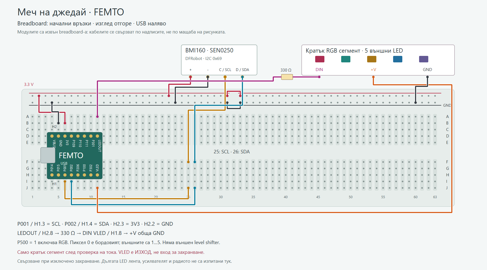
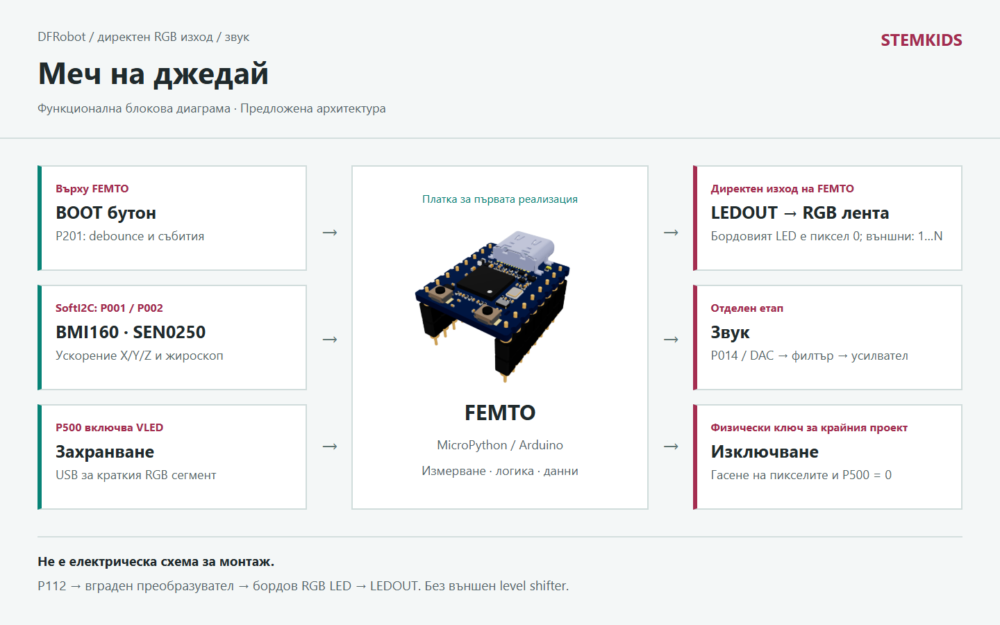

# Меч на джедай

FEMTO с директен LEDOUT за адресируеми RGB LED и DFRobot BMI160 за ускорение и въртене. Блокова схема, breadboard, светлина и звук.

Автор: STEMKIDS / tvendov

## Описание

# Меч на джедай

Светещ детски реквизит на STEMKIDS: адресируеми RGB светодиоди с дифузна светлина, звук при включване и движение, бутон и безопасно изключване. Това не е лазер, нагревател или предмет за удари. Проектът започва на маса с няколко светодиода и малка сила на звука.

## Какво прави всяка част

Конкретният проект използва FEMTO. Сензорът за движение подава измервания по SoftI2C на P001/P002. Бордовият BOOT бутон е на P201. Светлината използва директния RGB изход LEDOUT; звукът е отделен път през P014 / DAC, входен филтър и аудиоусилвател. Няма втори вариант с NANO в тези схеми.

## Светлина

Използваме адресируеми RGB светодиоди, не обикновена едноцветна или общоуправляема RGB лента. Всеки LED има собствен номер и отделни стойности R, G и B. Така светлината може да „израства“ от дръжката към върха, да сменя цвят и да изгасва последователно. Началният опит е с къса лента в мек дифузен корпус.

Семействата WS2812 и съвместимите RGB варианти са кандидати; точният модел се избира по захранване, ток, времеви параметри и механика. RGBW е различен формат и не се приема автоматично за RGB. Драйверът определя физическия ред на цветовете, който може да е GRB; приложението работи с тройки (R, G, B). В локалните M2 примери има ws2812_5_leds.py и neopixel_test.py, но това не е тест на новия меч.

FEMTO вече има преобразувател на логическите нива. Проверената схема е P112 -> UM3301 -> вход на бордовия RGB LED -> неговия DOUT -> LEDOUT на H2.8. Не добавяме външен SN74AHCT125. Външната лента се свързва към LEDOUT, не директно към P112. Пиксел 0 е бордовият, външните започват от 1.

P500 = 1 включва RGB захранването и разрешава преобразувателя. VLED на H1.8 е изход след бордовия захранващ ключ, не вход за външно захранване. За първия опит: USB без батерия, кратък 5-пикселен RGB сегмент, ниска яркост и предварително проверен ток. GND е обща, LEDOUT минава през 330 Ω към DIN. Дългата лента изисква отделен токов бюджет, силови проводници и защита; не пренасяме тока й през breadboard-а и не подаваме втори източник във VLED.

Прикачени са оригиналните FEMTO_PINOUT.pdf и FEMTO_SCHEMATIC.pdf. femto_rgb.py брои 1 бордов + N външни пиксела и държи бордовия изгасен. Примерът използва machine.WS2812 върху SCI2; UART(2) и SPI(2) не се използват едновременно с него.

## DFRobot сензор за ускорение и въртене

Избраният модул е Gravity BMI160, DFRobot SEN0250: триосен акселерометър плюс триосен жироскоп. Свързваме го по I2C, с 3.3 V захранване в този модел; фабричният адрес е 0x69, алтернативният е 0x68. Подробният сензорен BOM и сигналните връзки са във файла DFROBOT_BG.md.

Ускорението X/Y/Z е в m/s², а ъгловата скорост е в градуси/s. acceleration.py остава началният урок за ускорение; imu_model.py добавя непрекъснат управляващ коефициент за звук от жироскопа. Отделя въртенето около оста на острието от напречния замах, при изрично зададена монтажна ос. Това е модел на управление, не готов SmoothSwing миксер и не драйвер на BMI160.

Предлагаме начална настройка ±8 g, ±2000 градуса/s и 200 Hz за измерванията. Това е проектен избор, който още не е записван в реален модул. Bias на жироскопа, закъснението, насищането и фалшивите жестове трябва да се измерят. Инерциалният сензор не измерва сила в нютони или мястото на удар по острието.

Бутонът минава през debounce. Измерването на батерията може да използва ADC и изчислен делител. Прекъсването само отбелязва събитие; файлове, обработка на звук и дълги LED операции се изпълняват извън него. За първата демонстрация може да се използва и периодично проверяване на бутона без IRQ.

Източник: https://wiki.dfrobot.com/sen0250/

## Аудио и усилватели

За FEMTO предложеният път е P014 / H1.1 / DAC -> входно разделяне/филтър -> аналогов аудиоусилвател -> говорител. Изходът на микроконтролера не захранва говорител директно. Аудио монтажът е следващ етап и не е включен в началната breadboard схема.

LM4861 е конкретен вариант за малък моно усилвател с аналогов вход и shutdown. Говорителят е между двата мостови изхода; никой от тези два изхода не се свързва към GND. Подбират се захранване, товар и усилване по схемата на производителя. Не се свързва заземен щипков осцилоскоп към произволен мостов изход. Започва се с ниска сила на звука.

I2S усилвател не е пряка замяна на аналоговия. Нужни са I2S интерфейс, драйвер и съответните сигнали; не заявяваме наличен machine.I2S във всеки build. За аналоговия вариант не е нужен I2S модул.

Източник: https://www.ti.com/product/LM4861

## Логика на ефектите

Състоянията са OFF, IGNITING, ACTIVE, RETRACTING и FAULT. effects.py управлява виртуална яркост и звукови събития без хардуер. rgb_pixels.py превръща състоянието в списък от RGB тройки за отделните адресируеми LED. bench_demo.py подава симулирани събития: бутон, движение и ниска батерия. Ниският заряд изключва ефектите и изисква проверка на захранването; софтуерният праг се задава по конкретната батерия, не на око.

sound_demo.py генерира кратък WAV с математически тон, без чужди аудиозаписи. Форматът е PCM, mono, 8 bit, 16000 Hz. Този файл е тестов материал, не готов непрекъснат DAC stream. Следва да се добави адаптер към действителния audio/DAC API на избрания build. MicroPython и Arduino са възможни реализации, но наличните примери тук са Python.

dfrobot_demo.py подава синтетични шестосни измервания към imu_model.py: покой, нарастващ замах, завъртане и липса на нови данни. При грешка моделът връща нулеви аудио коефициенти. Реалното гасене на LED и amplifier shutdown трябва да се свърже към FAULT от приложението; този пример не управлява изходи.

## Корпус и захранване

Дифузорът и дръжката трябва да нямат остри ръбове, свободни клетки или достъпни проводници. Не е играчка за контактни двубои. Възрастен отговаря за механиката, батерията и зареждането. Първо се използва лабораторно захранване с ограничение на тока, после защитен батериен пакет с подходящ заряден модул. Предвиждат се физически ключ и защита на токовите клонове.

## KiCad и проверка

Прикачената блокова диаграма показва сигналните пътища. Не е електрическа схема. KiCad проект, компоненти с точни корпуси, пинове, филтър, усилване и конектори предстоят. Няма готовност за монтаж или за сертифицирана детска играчка.

Тествано на платка: Не. MicroPython build: не е избран. Няма измерен LED ток, аудио мощност, температура или физическа безопасност.

## Реализация

Платки: femto
Среда: micropython, host
Библиотеки: chips, machine, audio

Тествано: Не
Платка: не е указана
Build: не е указан

Маркерът за тест е посочен от автора на проекта.

## Схеми

## Диаграми

## Код

- [acceleration.py](code/acceleration.py)
- [bench\_demo.py](code/bench_demo.py)
- [dfrobot\_demo.py](code/dfrobot_demo.py)
- [effects.py](code/effects.py)
- [femto\_bus.py](code/femto_bus.py)
- [femto\_rgb.py](code/femto_rgb.py)
- [imu\_model.py](code/imu_model.py)
- [rgb\_pixels.py](code/rgb_pixels.py)
- [sound\_demo.py](code/sound_demo.py)
- [test\_effects.py](code/test_effects.py)
- [test\_femto\_rgb.py](code/test_femto_rgb.py)
- [test\_imu\_model.py](code/test_imu_model.py)

## Документи

- [BREADBOARD\_BG.md](documents/BREADBOARD_BG.md)
- [DFROBOT\_BG.md](documents/DFROBOT_BG.md)
- [FEMTO\_PINOUT.pdf](documents/FEMTO_PINOUT.pdf)
- [FEMTO\_SCHEMATIC.pdf](documents/FEMTO_SCHEMATIC.pdf)
- [PLAN\_BG.md](documents/PLAN_BG.md)
- [RESEARCH\_BG.md](documents/RESEARCH_BG.md)
- [TECHNOLOGIES\_BG.md](documents/TECHNOLOGIES_BG.md)

## Wiki

# Работен план

1. Пусни code/bench_demo.py и code/dfrobot_demo.py на компютър. Проследи състоянията, RGB пикселите и плавния коефициент от жироскопа без платка. Изпълни test_effects.py и test_imu_model.py.
2. Използвай FEMTO и запиши firmware build. SoftI2C: P001/P002; BOOT: P201; RGB: P112 през бордовия LED към LEDOUT, power-enable P500; бъдещ DAC: P014. Не използвай UART(2)/SPI(2) едновременно с machine.WS2812.
3. Само бутон и вграден LED: debounce, включване и изключване. Без външна лента и усилвател.
4. По breadboard схемата свържи кратък сегмент към LEDOUT, VLED и GND на FEMTO при изключено захранване. Първо провери тока и напрежението, после femto_rgb.py с ниска яркост. Бордовият пиксел е 0, външните са 1...N. VLED не е вход за втори захранващ източник.
5. Самостоятелно изпитай DFRobot SEN0250 (BMI160): I2C адрес, chip ID, настроени диапазони и честота. Калибрирай bias в покой и провери монтажната ос. Сравни бавно/бързо движение и чисто въртене по оста; настрой филтъра от измерванията. Няма готов MicroPython драйвер в този проект.
6. Провери DAC изхода без говорител. После свържи усилвателя по неговата схема, включи shutdown и провери покой, клипване и температура. Увеличавай звука постепенно.
7. Обедини LED и аудио: измери дали времето на обновяване пречи на сензора или води до пропуски в звука. Файловете не се четат от hard IRQ.
8. Добави диагностика за ниско захранване, липсващ сензор и прекъснат кабел. Хардуерният ключ остава независим от програмата.
9. Проектирай KiCad схема и механика след избора на модулите. ERC/DRC не заменят електрическото изпитване.
10. Провери общата система с локално управление: бутон, движение, светлина, звук и независим физически ключ.

## Предстои

- Реален MicroPython драйвер/адаптер за SEN0250, отделно акселерометър и жироскоп, timestamp, обработка на FIFO/пропуски; адаптери за RGB LED, бутон и audio/DAC.
- Пълно смесване на аудио слоеве. imu_model.py генерира само управляващи коефициенти, не звуков поток.
- Arduino версия на същия автомат, отделна компилация и отделни тестове.
- KiCad проект, токов бюджет, термично измерване и устойчив корпус.
- Запис за точната платка/build и проверките преди промяна на маркера „Тествано“.

